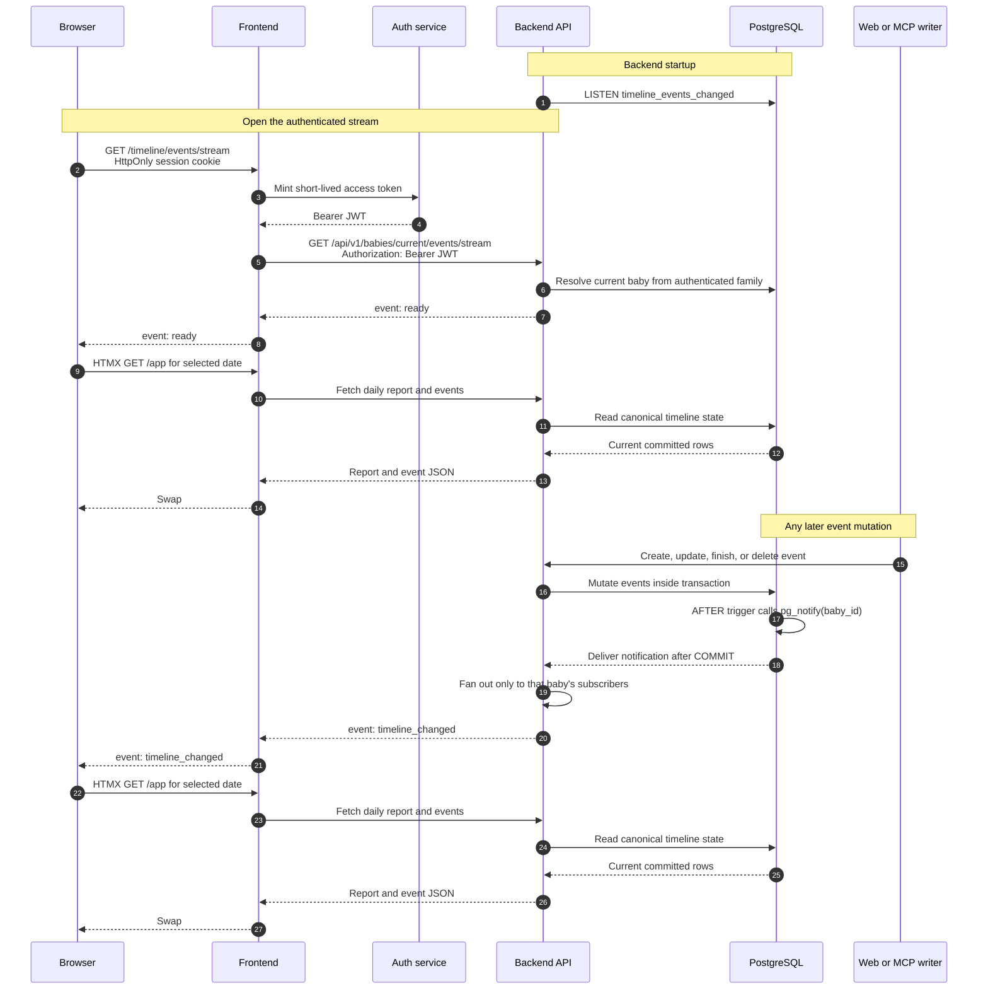

# How Timeline SSE Updates Work

Yauli uses Server-Sent Events (SSE) and PostgreSQL `LISTEN/NOTIFY` to make an
open timeline react immediately to event changes.

The design is intentionally an **invalidation pipeline**:

1. PostgreSQL says which baby's timeline changed.
2. SSE carries that small signal to the browser.
3. The browser re-fetches the canonical timeline and daily KPI card.

The notification never contains feed, sleep, nappy, note, or family data.

## End-to-end flow



## The four moving parts

### 1. PostgreSQL trigger

Migration `backend-api/migrations/0012_timeline_event_notifications.sql`
installs an `AFTER INSERT OR UPDATE OR DELETE` trigger on `events`.

The trigger calls:

```sql
SELECT pg_notify('timeline_events_changed', baby_id::text);
```

PostgreSQL delivers a notification only after the transaction commits. A
rolled-back event mutation therefore produces no externally visible update.

`NOTIFY` is transient: PostgreSQL does not retain messages for listeners that
are disconnected. That is acceptable because the message is only a request to
re-read state, not the state itself.

### 2. Backend `LISTEN` connection and hub

Every backend-api instance reserves one PostgreSQL pool connection and runs:

```sql
LISTEN timeline_events_changed;
```

When pgx receives a notification, the backend parses its `baby_id` payload and
signals only in-process subscribers for that baby. Each subscriber channel has
capacity one. If several mutations happen before a browser refreshes, the
signals coalesce because one “your view is stale” message is sufficient.

If the database listener disconnects, it reconnects with a short delay and
then signals every subscriber to reconcile. This covers notifications that
may have been missed during the gap.

### 3. Two authenticated SSE hops

The backend API is private and expects a bearer JWT. Browser JavaScript has
neither network access to that service nor access to the frontend's HttpOnly
session cookie value.

The stream therefore has two HTTP hops:

```text
Browser EventSource
    -> public frontend (session cookie)
    -> private backend-api (short-lived bearer JWT)
```

The frontend does not interpret or enrich SSE messages. It authenticates,
opens the private stream, copies bytes, and flushes them immediately.

The backend sends records in the standard SSE text format:

```text
retry: 3000
event: ready
data: connected

: heartbeat

event: timeline_changed
data: refresh

```

A blank line ends each record. Lines beginning with `:` are comments; the
heartbeat keeps the long-running response active through HTTP intermediaries.

### 4. Browser reconciliation

`frontend/static/app.js` creates:

```javascript
new EventSource("/timeline/events/stream")
```

Both `ready` and `timeline_changed` schedule an HTMX request for the currently
selected date. The response replaces `#timeline-workspace`, so the deterministic
daily KPI card and event list update together.

The browser debounces signals and allows only one refresh request at a time.
If the tab is hidden, it records that the view is dirty and waits until the tab
is visible before fetching. If the canonical refresh fails, the view stays
marked dirty and retries with exponential backoff from one second up to thirty
seconds. A successful refresh resets that delay.

Native `EventSource` automatically reconnects after network loss or a
server-side close. Every new `ready` event causes a canonical refresh, so
reconnection repairs any missed UI update.

## Authentication lifecycle

Auth-service access tokens last ten minutes. Backend-api validates the token
when the private stream opens and exposes its expiry to the SSE handler. The
handler closes the stream at that exact expiry.

`EventSource` then reconnects to the frontend. The frontend validates the
HttpOnly session again, mints a fresh bearer token, and opens a new private
stream. A revoked or expired session therefore cannot create another
authenticated stream.

An HTTP redirect on an EventSource request does not navigate the page. For
that reason, if the frontend session is no longer usable, the stream responds
with a named `navigate` event containing `/login` or `/onboarding`. The browser
closes the EventSource before navigating, preventing an automatic reconnect
loop against a session that cannot open a new stream.

## Why the stream does not contain event data

Sending full event objects over SSE would create a second timeline API and
make message loss a correctness problem. An invalidation-only signal instead
keeps these properties:

* backend-api remains the single owner of event and report business logic;
* frontend and MCP remain thin clients;
* authorization is checked again on canonical reads;
* duplicate SSE messages are harmless;
* missed messages are repaired on reconnect;
* adding a new event type does not change the SSE contract.

## Relevant implementation files

* PostgreSQL trigger:
  `backend-api/migrations/0012_timeline_event_notifications.sql`
* PostgreSQL listener and baby-scoped hub:
  `backend-api/internal/store/timeline_notifications.go`
* Backend SSE handler:
  `backend-api/internal/handlers/timeline_stream.go`
* Frontend backend client:
  `frontend/internal/backendclient/http.go`
* Frontend SSE proxy:
  `frontend/internal/handlers/timeline_stream.go`
* Browser `EventSource` and HTMX reconciliation:
  `frontend/static/app.js`

The architectural decision and its alternatives are recorded in
[ADR 0004](decisions/0004-sse-timeline-invalidation.md).
